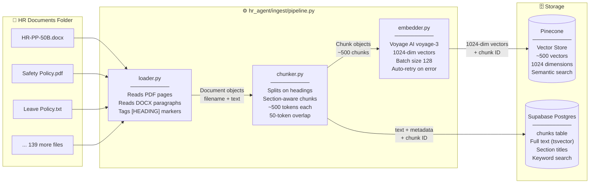
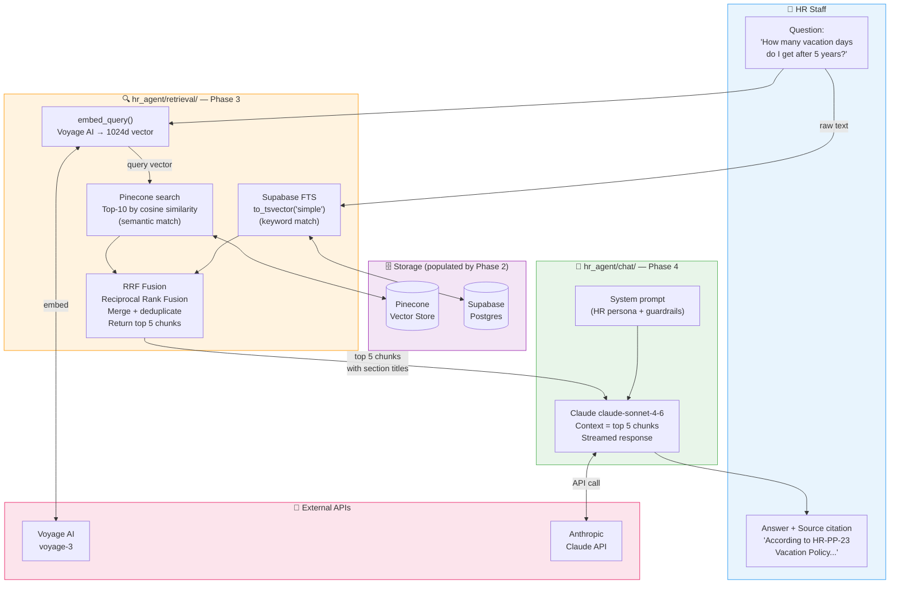
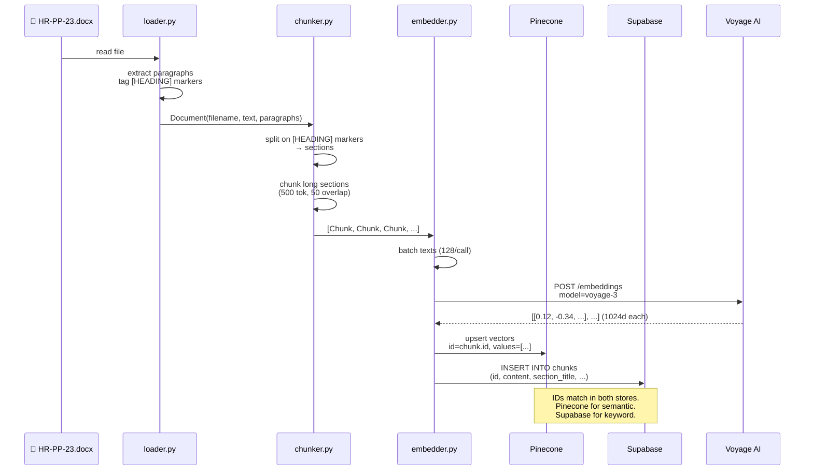
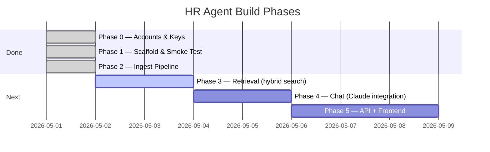

# HR Agent — Architecture & Pipeline

Open this file in VS Code and press `Ctrl+Shift+V` to see the diagrams rendered.

---

## 1. Project Folder Structure

```
hr-agent/
│
├── .env                        ← API keys (never commit)
├── config.py                   ← Settings singleton (reads .env)
├── requirements.txt            ← All Python dependencies
├── smoke_test.py               ← Verifies all 4 services connect
│
├── migrations/
│   └── 001_chunks.sql          ← Run once in Supabase SQL Editor
│
├── docs/
│   └── architecture.md         ← This file
│
└── hr_agent/                   ← Main Python package
    │
    ├── ingest/                 ← PHASE 2 ✅ (complete)
    │   ├── loader.py           ← Reads PDF / DOCX / TXT from disk
    │   ├── chunker.py          ← Splits docs into section-aware chunks
    │   ├── embedder.py         ← Sends chunks to Voyage AI (1024d vectors)
    │   └── pipeline.py         ← Orchestrates load → chunk → embed → store
    │
    ├── retrieval/              ← PHASE 3 (next)
    │   └── __init__.py         ← Hybrid search: semantic + keyword + RRF
    │
    └── chat/                   ← PHASE 4 (after retrieval)
        └── __init__.py         ← Claude integration + citations
```

---

## 2. Ingest Pipeline (Phase 2)



---

## 3. Full System Architecture (All Phases)



---

## 4. Data Flow — One Document, End to End



---

## 5. Phase Roadmap


